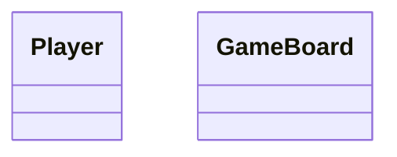

# Tic-Tac-Toe

## UML Diagaram for 1st Impelemention without following any Design pattern
```
This class diagram as raw Class Diagram when I implemented first time in C++
just by reading the problem as Design Tic Tac Toe. With Mindset to solve the problem 
as begineer you would probbaly do the same, No correct thought of different, even I have classes but never used
multiple iteration, laying down the class attributes and methods as code approches
```
---


---