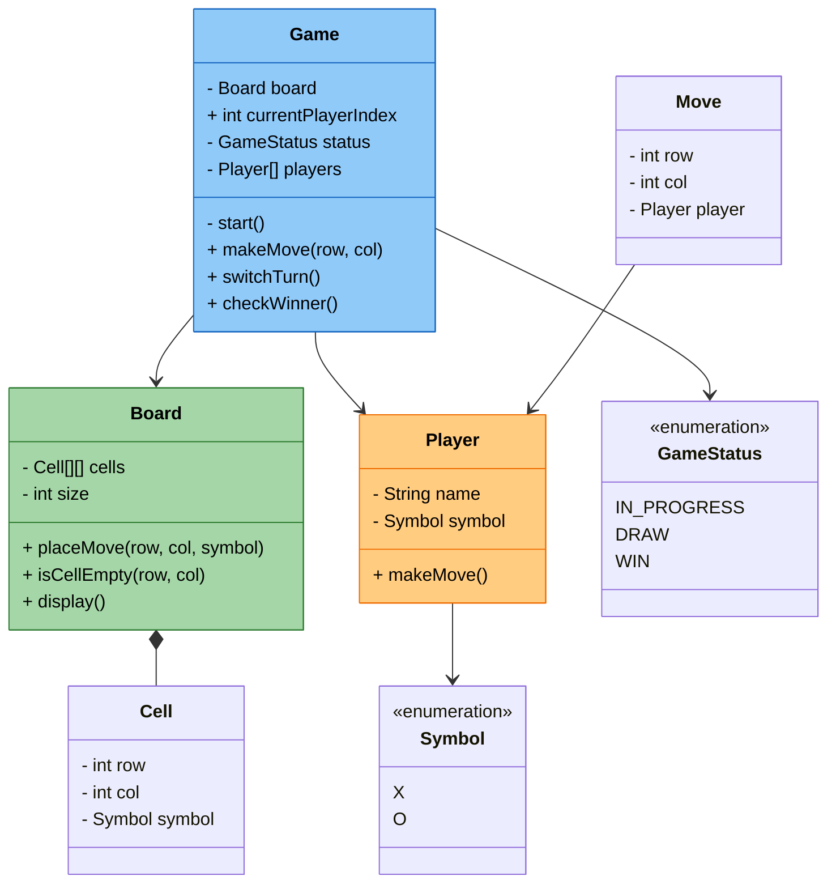
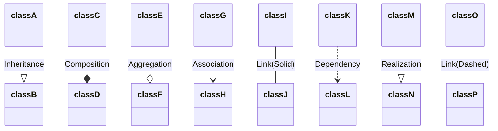
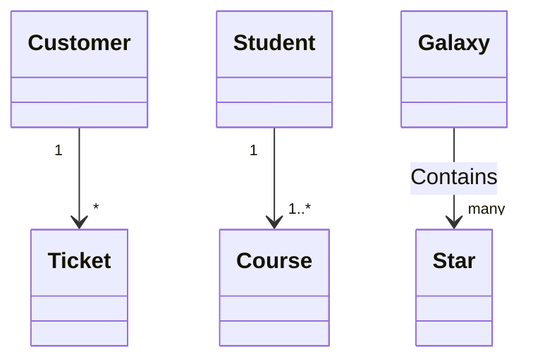

## this is for the class diagrm before ANY following LL
--


## Defining Relationship
```
Where Relation Type can be one of:

Type	Description
<|	Inheritance
\*	Composition
o	Aggregation
>	Association
<	Association
|>	Realization
And Link can be one of:

Type	Description
--	Solid
..	Dashed
```




## Cardinality / Multiplicity on relations
```Multiplicity or cardinality in class diagrams indicates the number of instances of one class that can be linked to an instance of the other class. For example, each company will have one or more employees (not zero), and each employee currently works for zero or one companies.

Multiplicity notations are placed near the end of an association.

The different cardinality options are :

1 Only 1
0..1 Zero or One
1..* One or more
* Many
n n (where n>1)
0..n zero to n (where n>1)
1..n one to n (where n>1)
Cardinality can be easily defined by placing the text option within quotes " before or after a given arrow
```

